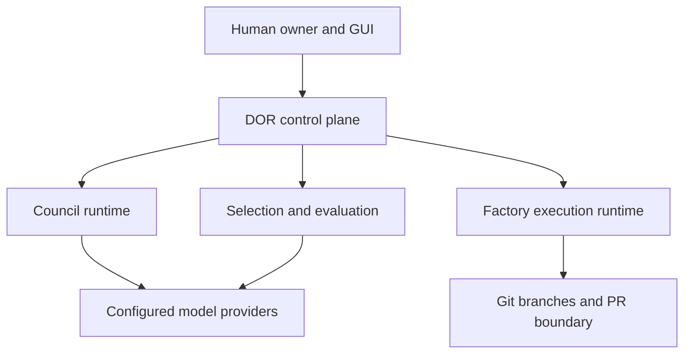

# Governed Multi-Bot Software Factory Architecture v1

```yaml
status: proposed
version: 1.0.0
owner: human
approval_required: true
```

## 1. Purpose

This architecture extends DOR into a governed, continuously operating software
factory in which multiple concrete bot identities can deliberate, implement,
verify, and deliver isolated candidate branches. It does not replace the
existing Agent Registry, Council, Authority, governed LLM, durable queue,
execution, verification, or release boundaries.

The architecture preserves this separation:

- humans define roles, allocate eligible bot profiles, and set autonomy;
- DOR owns durable state, policy, evidence, selection, and authority;
- model providers produce proposals and candidate changes;
- deterministic validators and independent evaluators assess results;
- only authorized integration and release components create terminal effects.

## 2. Normative vocabulary

The following identities MUST remain distinct:

| Term | Meaning |
| --- | --- |
| AI brand | Commercial or model-family label, for example Mistral |
| Provider connection | One tenant-owned endpoint and secret reference |
| Model deployment | A concrete model exposed by a provider connection |
| Bot profile | A stable configured worker identity using one deployment |
| Role definition | A user-defined responsibility and output contract |
| Role allocation pool | Bot profiles the human permits for one role |
| Protocol function | Provider-neutral runtime function performed by a role |
| Council template | Versioned choreography of user-defined roles and stages |
| Session assignment | Immutable selection of a bot profile for one run |
| Worker | Ephemeral compute that executes an assignment |
| Agent identity | Existing content-derived DOR registry identity |

Six API users of the same brand are six provider connections. Bot profiles
using those connections are independently identifiable, even if they use the
same model. Separate identity does not by itself prove independent judgment.

## 3. System context



LibreChat is one possible local provider and user interface. A local evaluator
served through LibreChat may assess outputs and recommend allocations, but
LibreChat is not the authoritative ledger, policy engine, or Authority Engine.

## 4. Canonical components

### 4.1 Existing components to extend

| Existing boundary | Extension |
| --- | --- |
| `phase4.agent_registry` | Link registered agent identities to tenant bot profiles |
| `phase4.council` | Accept a frozen selection plan instead of choosing the first match |
| `services.governed_llm` | Resolve calls through selected provider connections |
| `phase4.verification` | Apply role-specific rubrics and independence policy |
| `infrastructure.runtime.queue` | Dispatch tenant-scoped work packages with leases |
| `phase4.execution` | Bind execution to work package, assignment, and base SHA |
| `phase4.authority` | Authorize selection overrides, integration, and release |
| `GitPRPublisher` | Publish only an attested integration candidate |

The legacy `QualityFirstRouter` contains hardcoded provider and model choices.
It MUST NOT become the canonical allocator. Its callers must eventually migrate
to the provider-neutral Selection Engine described here.

### 4.2 New logical components

These are logical boundaries, not a mandate for separate services.

| Component | Responsibility | Forbidden responsibility |
| --- | --- | --- |
| Bot Catalog | Bot profiles, deployments, connection metadata | Credentials, authority |
| Role Catalog | User-defined role contracts and rubrics | Selecting unallocated bots |
| Template Catalog | Versioned Council/factory choreography | Provider or bot selection |
| Allocation Manager | Human-approved role-to-bot pools | Runtime execution |
| Selection Engine | Filter and rank eligible profiles | Expanding an allocation pool |
| Evaluation Coordinator | Combine deterministic and semantic evidence | Acting as sole authority |
| Performance Ledger | Immutable outcome observations | Rewriting historical scores |
| Task Graph Compiler | Contract-to-work-package decomposition | Executing code |
| Assignment Scheduler | Durable claims, leases, fencing | Accepting candidate output |
| Workspace Manager | Isolated worktree and branch lifecycle | Direct writes to `main` |
| Candidate Registry | Candidate branch and attestation records | Merging candidates |
| Integration Controller | Assemble accepted candidates | Self-authorizing release |

## 5. End-to-end flow

### 5.1 Deliberation

1. A Requirement Steward produces a canonical, fingerprinted requirement.
2. The human selects a Council template and approves role allocation pools.
3. The Selection Engine selects concrete bot profiles only from those pools.
4. DOR freezes assignments, provider/model versions, prompts, and base SHA.
5. The proposer creates the architecture proposal.
6. independently assigned reviewers create structured reviews and disputes.
7. Every material dispute is accepted, mitigated, rejected with evidence, or
   left open. An open blocking dispute prevents readiness.
8. An independent verifier evaluates the final proposal and evidence chain.
9. Authority and any required human gate approve the architecture contract.

### 5.2 Realization

1. The approved architecture and contracts are compiled into a dependency DAG.
2. Ready work packages are published to the durable tenant queue.
3. A concrete bot profile is selected from the allocated implementation pool.
4. A worker claims the package with a lease and fencing token.
5. Workspace Manager creates an isolated worktree from the exact base SHA.
6. The worker produces commits on a task-specific branch.
7. Deterministic checks and independent review create evaluation records.
8. Accepted candidate branches become eligible for an integration plan.
9. Integration Controller assembles candidates in dependency order and runs
   the complete acceptance suite.
10. Release authority may publish one PR for the attested integration result.

### 5.3 Collaborative and competitive execution

A work package declares one mode:

- `single`: one selected implementation assignment;
- `parallel_components`: separate bots own disjoint work packages;
- `competing_candidates`: multiple bots implement the same contract in
  isolated branches and an independent evaluator selects at most one winner.

Competing candidates share a logical task ID but have different candidate and
execution IDs. They never share a writable worktree.

## 6. Selection architecture

Selection is a deterministic policy decision informed by performance evidence.
It is not an unrestricted LLM choice.

1. Load the human-approved allocation pool for the role.
2. Reject profiles that fail tenant, lifecycle, capability, data residency,
   tool, budget, availability, or independence requirements.
3. Rank remaining profiles using a versioned scoring policy.
4. Record all candidates, exclusions, input metrics, score components, and the
   selected profile in a content-addressed decision.
5. Freeze the selection in the session or work-package assignment.

A local LibreChat evaluator may recommend weights or a candidate. DOR validates
the recommendation against the same hard filters. It cannot add a profile to a
pool, relax a hard constraint, or grant itself authority.

### 6.1 User-defined roles and fixed protocol semantics

Role names, purposes, prompts, schemas, rubrics, and bot pools are configured by
the human. Runtime choreography uses a small provider-neutral protocol function
vocabulary: `conversation_owner`, `proposer`, `reviewer`, `verifier`,
`implementer`, `candidate_evaluator`, and `integrator`. A role selects one
function; it never selects a brand or model.

A versioned Council template orders stages and references role IDs. This lets a
human define "Chief Architect", "Privacy Challenger", or any other seat while
the runtime still knows which role proposes, reviews, verifies, or integrates.
Changing a template version creates a new session configuration and cannot
alter an active session.

## 7. Evaluation and learning architecture

### 7.1 Evaluation layers

| Layer | Examples | Authority |
| --- | --- | --- |
| Contract | Schema, provenance, fingerprints | Hard fail |
| Deterministic | Compile, tests, lint, policy, patch scope | Hard fail where configured |
| Semantic | Requirement coverage, reasoning, risk, maintainability | Evidence, not sole authority |
| Downstream | Rework, integration, regression, rollback, production incident | Outcome evidence |
| Human | Accept, reject, preference, product value | Policy-dependent gate |

The producer cannot validate its own output as the sole verifier. For high-risk
work the independence policy may require a different bot profile, provider
connection, model family, brand, or deployment.

### 7.2 Performance learning

The initial learning mechanism is an immutable performance ledger, not model
fine-tuning. Observations are scoped by bot profile, role, task class, risk,
technology, and rubric version. Historical records are never overwritten.

Selection may use aggregated observations only after minimum sample and data
quality thresholds are met. Exploration is permitted only among human-allocated
profiles and within an explicit risk policy. Critical tasks default to no
exploration.

### 7.3 Progressive autonomy

| Level | Local evaluator/allocator behavior |
| --- | --- |
| 0 | Observe and evaluate only |
| 1 | Recommend a bot; human confirms |
| 2 | Select within approved pools |
| 3 | Adjust bounded scoring weights |
| 4 | Propose pool or policy changes for human approval |
| 5 | Modify explicitly delegated pools under a verified grant |

Autonomy is configured per organization, role, and risk class.

## 8. Persistence ownership

Every record is tenant-scoped and immutable or versioned as appropriate.

| Aggregate | Key facts |
| --- | --- |
| Provider connection | Endpoint metadata, secret reference, region, status |
| Bot profile | Agent identity, deployment, capabilities, prompt version |
| Role definition | Purpose, required capability, output schema, rubric |
| Council template | Ordered stages, protocol functions, role IDs, quorum |
| Allocation pool | Allowed profiles, constraints, human approval, version |
| Selection decision | Candidates, exclusions, scores, policy, fingerprint |
| Session assignment | Frozen role/profile/provider/model/prompt snapshot |
| Evaluation record | Subject, rubric, checks, evaluator, evidence, outcome |
| Performance observation | Immutable result signal derived from evaluation |
| Work package | Contract binding, dependencies, write scope, execution mode |
| Candidate delivery | Branch, commits, patch fingerprint, attestations |
| Integration plan | Ordered accepted candidates and exact base SHA |

Secrets are never copied into profiles, assignments, prompts, audit records, or
candidate metadata. Only a secret-manager reference is persisted.

## 9. Security and concurrency invariants

1. A bot can be selected only if the human allocated it to the role.
2. Brand names are metadata and never runtime identities.
3. Cross-tenant connection, profile, pool, selection, or evaluation access
   behaves as not found.
4. No silent provider or bot fallback is permitted.
5. Session assignments are immutable after the first provider call.
6. Every provider call is bound to organization, assignment, purpose, input
   fingerprint, prompt version, model, and repository revision.
7. A producer cannot be the sole verifier of its own result.
8. Semantic evaluation cannot override a deterministic hard failure.
9. Learning cannot expand a human-approved allocation pool.
10. A worker without the current lease and fencing token cannot deliver.
11. Every execution has an isolated workspace and branch.
12. No bot writes directly to the protected branch.
13. Multiple candidates are permitted; at most one is accepted per logical
    task and integration plan.
14. Changed contracts or base SHA invalidate stale assignments and attestations.
15. Integration and PR publication require separate authority grants.
16. DOR durable state, not model memory or chat history, is authoritative.
17. Every irreversible side effect has an idempotency key and durable receipt.
18. Selection and evaluation decisions must be reproducible from versioned
    policy and immutable evidence.

## 10. Failure semantics

- Missing eligible bot: `SELECTION_BLOCKED`, never implicit fallback.
- Provider unavailable before a call: selection may be re-run only through a
  visible substitution decision allowed by policy.
- Provider failure after claim: preserve attempt evidence and follow bounded
  retry policy with the same assignment identity.
- Evaluator unavailable: deterministic checks remain valid; semantic approval
  remains pending.
- Worker lease expiry: another worker may reclaim; stale delivery is rejected.
- Branch exists but receipt is missing: reconcile by immutable branch and commit
  identity before retrying any external effect.
- Integration conflict: reject the integration attempt and issue explicit
  rework; never auto-resolve semantic conflicts.

## 11. Migration strategy

1. Add provider-neutral catalog, allocation, selection, and evaluation models.
2. Adapt Council to accept an explicit assignment plan while preserving its
   existing four-role default as a migration template.
3. Replace `candidates[0]` selection with the Selection Engine.
4. Adapt governed LLM provider resolution to frozen session assignments.
5. Introduce work-package and candidate-delivery contracts around the existing
   queue and execution boundaries.
6. Introduce integration planning before changing release behavior.
7. Deprecate hardcoded `QualityFirstRouter` endpoints after all callers migrate.

No existing authority or verification gate may be weakened during migration.

## 12. Architecture acceptance criteria

- Six connections from one brand can create six distinguishable bot profiles.
- GUI-created roles and allocations can be round-tripped without provider names
  in domain enums.
- Selection never chooses outside the approved allocation pool.
- A selection can be reproduced from its policy version and input snapshot.
- Council can run with user-selected bot profiles and resume after restart.
- A local evaluator can score a response but cannot grant authority.
- Performance evidence affects ranking only after configured thresholds.
- Twenty workers can deliver isolated candidate branches concurrently.
- A stale worker cannot register or integrate a candidate.
- Competing candidates result in at most one accepted candidate.
- Integration and release remain separately authorized and idempotent.
