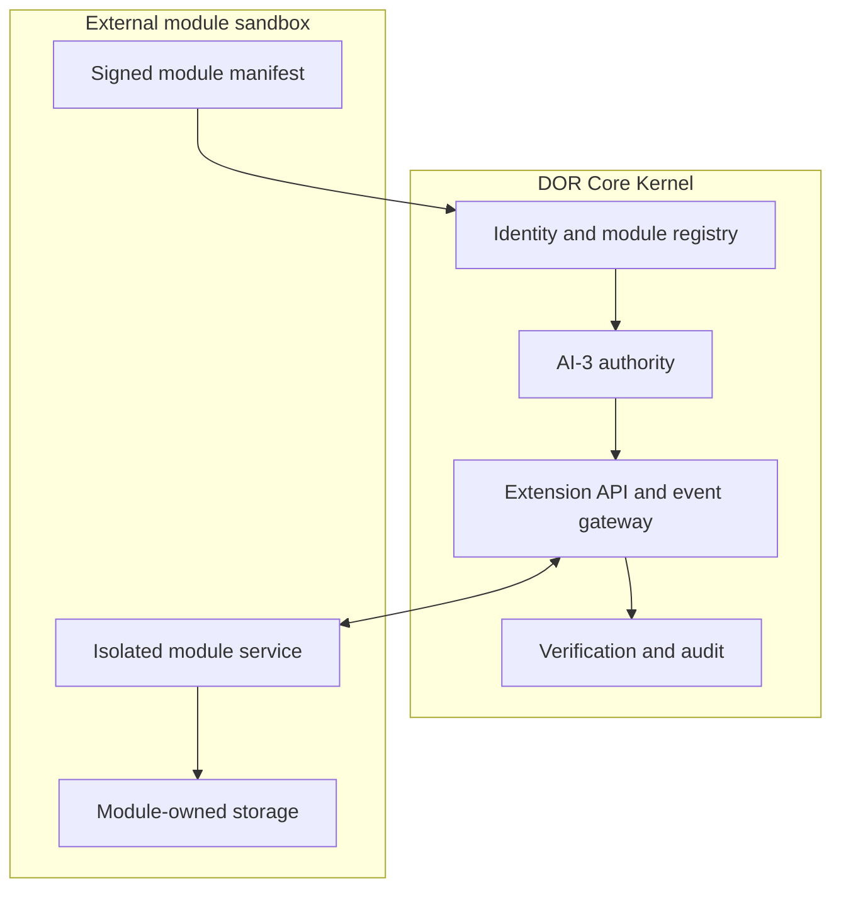

# P4 — Module & Extension Architecture Specification

| Metadata | Value |
| --- | --- |
| Document version | 1.0.0 |
| Status | Approved Draft |
| Target milestone | Phase 4 — Agent Ecosystem & Extensions |
| Security level | High — fail-closed isolation boundary |

---

## 1. Purpose and core principle

The Digital Organization Runtime (DOR) Core Kernel remains a deterministic,
security-hardened execution and governance boundary. Business-specific
functionality—such as legacy-code ingestion, budgeting and costing, dashboard
extensions, time tracking, or enterprise integrations—belongs in independently
deployable modules.

> **Golden rule:** A module never accesses the Core database, persistence
> adapters, in-process runtime state, or execution adapters directly. It acts as
> an external DOR actor and communicates only through versioned extension
> contracts after explicit identity, authority, and verification checks.

The Kernel owns only the shared control plane:

- identity and lifecycle declarations;
- authority and capability evaluation;
- versioned API and event contracts;
- deterministic orchestration and bounded execution;
- verification, audit, and revocation.

Module business logic, storage, user interfaces, credentials, and failure
domains remain outside the Kernel.

This specification is normative design input. It does **not** claim that the
module registry, manifest schema, extension API, or dispatcher already exists.
No module is production-eligible until the acceptance criteria in section 14
are implemented and verified.

## 2. Architectural boundary



The boundary has two complementary contract surfaces.

### 2.1 External Extension API

External modules communicate over authenticated, versioned HTTPS APIs,
webhooks, or event streams. Every request is bound to:

- one registered module identity;
- one organization-scoped `actor_id`;
- one concrete action and resource;
- one explicit authority decision;
- one correlation and idempotency identity.

The API never exposes database connections, ORM models, internal repository
objects, secrets, or general-purpose execution primitives.

### 2.2 Internal Service Provider Interface

The Service Provider Interface (SPI) is a Kernel-owned set of typed ports and
event semantics. It defines when the Kernel may publish an event or invoke a
bounded extension operation. Third-party module code is **not** imported or
executed in the Kernel process.

Trusted, Core-owned adapters may implement an SPI port in-process. External
modules consume the corresponding network contract through the Extension API.
This distinction prevents a Python plugin interface from silently bypassing
the sandbox.

Initial semantic hooks are:

| SPI event | External event type | Intended use |
| --- | --- | --- |
| Intent resolved | `intent.resolved` | Advisory estimation or enrichment after intent resolution |
| Verification completed | `verification.completed` | Read-only UI or reporting updates after P3-20 |
| Execution started | `execution.started` | Metering or resource reservation |
| Execution completed | `execution.completed` | Cost settlement, time tracking, or reporting |

The canonical event catalog, payload schema, and compatibility rules must be
versioned independently from module implementations.

## 3. Lifecycle and authority

A module progresses only through explicit lifecycle records:

```text
PENDING_VALIDATION -> APPROVED -> ACTIVE -> SUSPENDED -> ACTIVE
                                \-> REVOKED
```

`REVOKED` is terminal for a manifest fingerprint and actor binding. Re-enabling
the same software requires a new registration decision. Lifecycle changes
create immutable replacement records and audit events; they do not mutate
history in place.

The following separation is mandatory:

1. The module manifest **declares** requested capabilities.
2. Registration validates identity, provenance, compatibility, and syntax.
3. An organization administrator may bind an approved module to a service
   actor and role.
4. The canonical authority path evaluates every concrete operation.
5. A missing, stale, mismatched, suspended, or denied decision blocks the call.

The governing invariant is:

```text
requested capability != granted role != authority decision != execution
```

This preserves the separation already defined by the
[AI-1 Agent Registry contract](AI-1-Agent-Registry-Contract.md), the
[AI-3 Authority Engine](../../phase4/authority/ARCHITECTURE.md), and the
[AI-4 Execution Engine](../../phase4/execution/ARCHITECTURE.md).

## 4. Module manifest contract (`module.yaml`)

Every module **must** present a signed `module.yaml` at registration. The
registration boundary parses YAML using a safe loader, rejects duplicate keys
and aliases, converts the result to the canonical JSON data model, validates it
against the exact declared schema version, and verifies the signature before
creating any registry record or actor binding.

### 4.1 Example manifest

```yaml
schema_version: "1.0.0"

module:
  id: "dor.module.budget-costing"
  name: "LLM Budget & Project Valuation Engine"
  version: "1.0.0"
  publisher: "DOR Core Ecosystem"
  description: >-
    Calculates token consumption, project pricing, and financial budget
    stop-gates.

compatibility:
  dor_extension_api: ">=1.0.0 <2.0.0"
  event_catalog: "1.0.0"

identity:
  actor_role: "module_service_account"
  trust_anchor_key_id: "dor-publisher-2026-01"
  requested_capabilities:
    - "project_definition.read"
    - "scaffold_plan.read"
    - "vault_rate.read"
    - "budget_gate.write"

health:
  endpoint_url: "https://budget-module.internal/health"
  timeout_ms: 1000

event_subscriptions:
  - event_type: "intent.resolved"
    event_schema_version: "1.0.0"
    endpoint_url: "https://budget-module.internal/api/v1/hooks/on-intent"
    delivery_mode: "async"
    criticality: "advisory"
    timeout_ms: 3000
    retry_policy:
      max_attempts: 3
      initial_backoff_ms: 250
      max_backoff_ms: 2000

  - event_type: "execution.completed"
    event_schema_version: "1.0.0"
    endpoint_url: "https://budget-module.internal/api/v1/hooks/on-execution"
    delivery_mode: "async"
    criticality: "advisory"
    timeout_ms: 1000
    retry_policy:
      max_attempts: 3
      initial_backoff_ms: 250
      max_backoff_ms: 2000

extensions:
  ui_views:
    - slot_id: "project_dashboard.tabs"
      title: "Budget & Valuation"
      frame_url: "https://budget-module.internal/ui/tab"

signature:
  algorithm: "ed25519"
  key_id: "dor-publisher-2026-01"
  value: "<base64-signature>"
```

The example requests capabilities; it does not grant them. Capability IDs use
the Kernel's canonical dot-separated naming convention.

### 4.2 Required validation

Registration must reject the complete manifest, without partial state changes,
when any of the following is true:

- an unknown or unsupported `schema_version` is supplied;
- `module.id`, module version, or compatibility range is invalid;
- an unknown field appears where the schema disallows additional properties;
- capability or event identifiers are not present in their canonical catalogs;
- the signature, publisher trust anchor, or key status is invalid;
- an endpoint violates the outbound network policy;
- duplicate capabilities, subscriptions, UI slots, or object keys are present;
- numeric bounds, payload limits, or retry ceilings are exceeded;
- the manifest fingerprint already exists in an incompatible lifecycle state.

Schema validation alone is insufficient; semantic and policy validation are
separate fail-closed gates.

## 5. Canonicalization, signature, and identity

For schema version 1.x:

1. Parse YAML into the schema's JSON-compatible data model.
2. Remove the top-level `signature` object from the signed payload.
3. Canonicalize the remaining value using RFC 8785 JSON Canonicalization
   Scheme semantics.
4. Compute `manifest_fingerprint = SHA-256(canonical_bytes)`.
5. Verify the Ed25519 signature over `canonical_bytes` using the exact
   registered `key_id`.
6. Bind the verified fingerprint, publisher, key ID, organization, actor, and
   lifecycle record in the immutable audit trail.

The signature proves possession of a trusted publishing key. It does not grant
authority, certify module quality, or approve requested capabilities. Trust-key
rotation and revocation must preserve historical verification evidence.

## 6. Planned immutable Core models

Phase 4 extension contracts should live with the other Phase 4 bounded models,
with the planned implementation location `phase4/extensions/models.py`. They
must not revive deprecated runtime or generic domain paths.

The following code illustrates the minimum immutable shape; the implementation
slice must add full validation and canonical serialization:

```python
from dataclasses import dataclass
from enum import Enum


class ModuleStatus(str, Enum):
    PENDING_VALIDATION = "pending_validation"
    APPROVED = "approved"
    ACTIVE = "active"
    SUSPENDED = "suspended"
    REVOKED = "revoked"


class SubscriptionCriticality(str, Enum):
    ADVISORY = "advisory"
    CRITICAL_GOVERNANCE_GATE = "critical_governance_gate"


@dataclass(frozen=True)
class RetryPolicy:
    max_attempts: int = 3
    initial_backoff_ms: int = 250
    max_backoff_ms: int = 2000


@dataclass(frozen=True)
class EventSubscription:
    event_type: str
    event_schema_version: str
    endpoint_url: str
    delivery_mode: str
    criticality: SubscriptionCriticality
    timeout_ms: int = 3000
    retry_policy: RetryPolicy = RetryPolicy()


@dataclass(frozen=True)
class ModuleManifest:
    schema_version: str
    module_id: str
    name: str
    version: str
    publisher: str
    actor_role: str
    trust_anchor_key_id: str
    requested_capabilities: tuple[str, ...]
    event_subscriptions: tuple[EventSubscription, ...] = ()
    metadata: tuple[tuple[str, str], ...] = ()


@dataclass(frozen=True)
class RegisteredModule:
    manifest: ModuleManifest
    manifest_fingerprint: str
    status: ModuleStatus
    organization_id: str
    assigned_actor_id: str | None
    registered_by: str
    registered_at: str
```

Frozen dataclasses alone are not enough when fields contain mutable values.
Tuples and immutable value objects are therefore required at the contract
boundary; callers must not retain mutable aliases.

## 7. Network and sandbox policy

External modules run in a separate process, container, account, or network
security boundary. Registration does not imply network reachability.

The event gateway must enforce all of the following:

- HTTPS only; plaintext HTTP and non-HTTP schemes are rejected;
- exact hostname and port allowlists resolved from operator policy, not from
  module-controlled redirects;
- no redirects, URL credentials, fragments, wildcard hosts, or IP literals;
- DNS resolution and connection targets are checked against the allowed
  network ranges to prevent SSRF and rebinding;
- bounded connect, read, total, payload, and decompression limits;
- certificate validation against an operator-approved trust store;
- no proxy inheritance unless explicitly configured by the operator;
- module-specific rate, concurrency, and circuit-breaker limits;
- no Kernel credentials, database credentials, or unrelated environment
  variables in the module sandbox.

A module failure, crash, timeout, or malformed response cannot corrupt Kernel
state. Health status is diagnostic only and never substitutes for authority.

## 8. Authentication, authorization, and audit

Each request from a module must use a short-lived, audience-bound identity
token or mutually authenticated TLS credential issued for the assigned service
actor. Tokens must include or bind at least:

- issuer and audience;
- module identity and manifest fingerprint;
- `actor_id` and `organization_id`;
- issue, expiry, and unique token identity;
- credential/key version.

Requested capabilities are never copied into a token as self-authorizing
scopes. The Kernel evaluates the concrete capability and resource through the
canonical organization-scoped authority boundary. Unauthorized calls return
`403 Forbidden` without leaking cross-organization resource existence.

Every accepted and rejected call records an immutable audit event containing
the actor, organization, action, resource, correlation ID, authority decision
fingerprint, manifest fingerprint, outcome, and bounded failure metadata.
Credentials, signatures, secrets, and full sensitive payloads must never enter
the audit stream.

## 9. Event delivery contract

Every delivered event uses a versioned envelope with:

- `event_id`, `event_type`, and `event_schema_version`;
- `occurred_at` and delivery `attempt`;
- `organization_id` and producing `actor_id` when applicable;
- `correlation_id` and `causation_id`;
- idempotency key;
- bounded payload and payload SHA-256;
- Kernel signature, timestamp, and key ID.

The receiving module verifies the signature and replay window before
processing. Handlers must be idempotent for `event_id`; retries never create a
new semantic event identity.

### 9.1 Advisory subscriptions

Advisory delivery is asynchronous. Timeout, exhaustion, invalid response, or
module unavailability is audited and isolated. It does not roll back or halt a
committed Core transition.

### 9.2 Critical governance gates

`critical_governance_gate` is not a module-selected privilege. It requires an
explicit, human-approved Core policy binding to a predefined synchronous hook.
When such a gate is unavailable, times out, returns malformed evidence, or
fails verification, the gated action does not proceed. The Kernel records a
fail-closed denial; it does not infer approval or silently downgrade the hook
to advisory.

Critical gates must not replace the independent P3-20 verification decision.

## 10. Extension API behavior

The Extension API must:

- use a versioned namespace such as `/api/extensions/v1`;
- validate content type, schema, size, and unknown fields before business
  handling;
- require an idempotency key for state-changing operations;
- bind each request to one exact authority question and decision;
- return stable machine-readable error codes;
- use pagination and hard result limits for reads;
- prevent arbitrary query, path, template, command, or adapter selection;
- never expose internal stack traces or credential-bearing errors;
- support explicit deprecation and compatibility windows.

WebSocket or streaming access follows the same identity and authority rules.
Connection authorization does not grant indefinite access: subscriptions are
re-evaluated on token expiry, policy change, suspension, and revocation.

## 11. UI extension policy

A declared UI view is metadata, not executable Core code. UI extensions:

- render in a sandboxed, cross-origin frame;
- receive no Kernel session cookie or bearer token;
- use a narrow, versioned `postMessage` contract with exact origin checks;
- cannot navigate the parent, open unrestricted popups, or request arbitrary
  browser permissions;
- are constrained by Content Security Policy and an operator allowlist;
- access Core data only through the same authenticated Extension API;
- are removed immediately from discovery when the module is suspended or
  revoked.

## 12. Compatibility and change management

Module, manifest schema, API, and event catalog versions use semantic
versioning but are independent values.

- Patch changes do not alter a contract's accepted shape or semantics.
- Minor changes may add optional, backward-compatible fields or event types.
- Major changes may remove fields or change semantics and require explicit
  migration and re-registration.
- Unknown major versions fail closed.
- Unknown fields fail closed unless the active schema explicitly permits an
  extension namespace.
- A changed security-relevant manifest creates a new fingerprint and requires
  revalidation; publisher metadata alone never bypasses this rule.

The Kernel must support an operator-defined overlap window for migrations. It
must not silently translate authority, criticality, or security semantics
between major versions.

## 13. Explicit non-goals

This architecture does not provide:

- an in-process marketplace for arbitrary Python packages;
- direct database, ORM, repository, event-bus, or execution-adapter access;
- capability grants based on manifest declarations;
- module-controlled registration, trust anchors, or criticality elevation;
- arbitrary outbound HTTP from the Kernel;
- distributed transactions between Core and modules;
- a guarantee that a healthy module is correct or authorized;
- a path around AI-3 authority, AI-4 bounded execution, or P3-20 verification.

## 14. Verification and acceptance criteria

Before the first production module is activated, all applicable checks below
must be automated and green.

### M1 — Manifest and provenance

- [ ] A versioned JSON Schema exists at
      `docs/phase4/schemas/module-manifest-v1.schema.json`.
- [ ] Valid manifests produce deterministic canonical bytes and fingerprints.
- [ ] Duplicate YAML keys, aliases, unknown fields, and unsafe values fail
      closed.
- [ ] Signature, trust-anchor rotation, expiry, and revocation tests pass.
- [ ] Invalid registration leaves registry, actor, role, and audit state
      unchanged except for a bounded rejection audit entry.

### M2 — Identity and authority

- [ ] Registration never grants a requested capability.
- [ ] Actor and organization bindings are explicit and immutable per lifecycle
      record.
- [ ] Every Extension API operation requires an exact authority decision.
- [ ] Missing, mismatched, stale, suspended, revoked, and cross-organization
      identities are denied and audited.
- [ ] Token replay, wrong audience, expired token, and key revocation tests pass.

### M3 — Event integrity

- [ ] Event catalogs and envelope schemas are versioned.
- [ ] Event signature, payload digest, replay-window, and idempotency tests pass.
- [ ] Retry counts, backoff, concurrency, payload, and timeout bounds are
      enforced.
- [ ] Advisory module failure cannot halt or mutate the Core pipeline.
- [ ] A policy-bound critical gate fails closed and cannot be declared by a
      module.

### M4 — Isolation and network security

- [ ] Modules have no Core database credentials or network path to persistence.
- [ ] Scheme, redirect, DNS rebinding, private-address, alternate-port,
      decompression-bomb, and oversized-response tests pass.
- [ ] A crashed, malicious, slow, or disconnected module cannot corrupt Kernel
      state or exhaust Kernel workers.
- [ ] UI sandbox, origin, CSP, cookie, and token-boundary tests pass.

### M5 — Audit and operations

- [ ] Accepted, denied, failed, replayed, suspended, and revoked operations are
      reconstructable from immutable audit evidence.
- [ ] Audit records contain no credentials, raw signatures, secrets, or
      unrestricted payloads.
- [ ] Suspension and revocation take effect within a defined, tested maximum
      propagation interval.
- [ ] Metrics and alerts cover rejection rate, latency, retry exhaustion,
      circuit state, signature failure, and replay detection.
- [ ] Backup, recovery, key rotation, and rollback procedures are exercised.

### M6 — Core regression boundary

- [ ] Existing Core tests remain green without any module running.
- [ ] Core startup and health do not depend on module availability.
- [ ] No Phase 3 contract is weakened or bypassed.
- [ ] The module API, registry, dispatcher, and first reference module pass an
      independent Project Audit Agent assessment.

## 15. Delivery slices

Implementation should proceed in reviewable, fail-closed slices:

1. Manifest JSON Schema, canonicalization, signature verification, and contract
   tests.
2. Immutable Phase 4 extension models and audited module registry.
3. Organization-scoped actor/role binding and exact authority integration.
4. Versioned Extension API with one read-only reference operation.
5. Signed asynchronous event envelope and bounded dispatcher.
6. Suspension, revocation, observability, and adversarial isolation tests.
7. Sandboxed UI contract, only if a concrete module requires it.
8. Critical governance gates, only after independent security review.

Each slice requires its own architecture boundary, tests, audit evidence, and
human approval. A later slice must not be pulled forward implicitly by an
earlier manifest declaration.

## 16. Related DOR contracts

- [AI-1 Agent Registry Contract](AI-1-Agent-Registry-Contract.md)
- [AI-7 Agent Orchestrator Contract](AI-7-Agent-Orchestrator-Contract.md)
- [AI-3 Authority Engine](../../phase4/authority/ARCHITECTURE.md)
- [AI-4 Execution Engine](../../phase4/execution/ARCHITECTURE.md)
- [P3-20 Independent Verification Gate](../phase3/P3-20_Independent_Verification_Gate.md)
- [Phase 3 Authority Execution Contract](../PHASE3_AUTHORITY_EXECUTION_CONTRACT.md)
